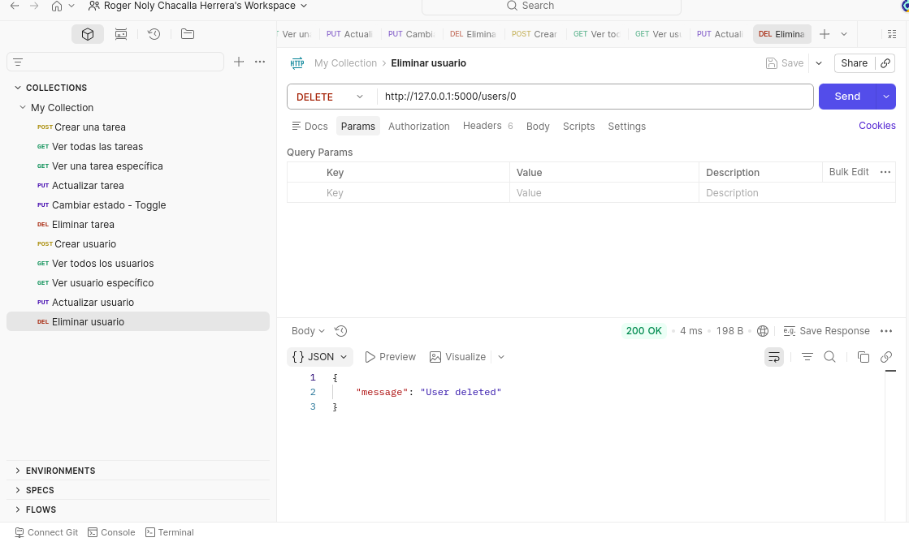
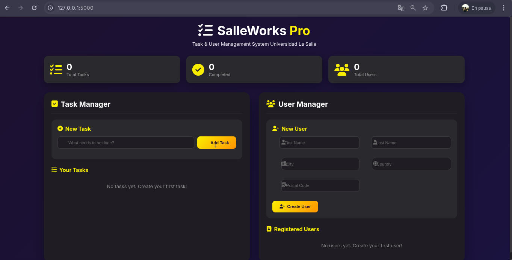

# Task Manager API - Flask

## Descripción

Este proyecto es una API REST desarrollada con Flask que permite gestionar tareas (CRUD completo) y usuarios.  
Forma parte de la sesión 1 de Backend Introduction.

---

## Conceptos aplicados

- Flask (framework backend)
- API REST
- Métodos HTTP (GET, POST, PUT, DELETE)
- Manejo de JSON
- Routing dinámico
- Estructura básica frontend (HTML, CSS, JS)

---

## Tecnologías usadas

- Python 3.11
- Flask
- HTML, CSS, JavaScript

---

## Estructura del proyecto

flask_project/
│── app.py
│── static/
│ ├── style.css
│ └── script.js
│── templates/
│ └── index.html
│── screenshots/
│ ├── postman.png
│ └── web.png

---

## Evidencia del funcionamiento

### 🔹 Pruebas en Postman



### 🔹 Interfaz Web



---

## Funcionalidades

### Tasks

- Crear tarea → POST /tasks
- Listar tareas → GET /tasks
- Actualizar tarea → PUT /tasks/<id>
- Eliminar tarea → DELETE /tasks/<id>

### Users

- CRUD completo de usuarios
- Soporte para estructura compleja (address)

---

## Cómo ejecutar el proyecto

```bash
# Activar entorno
conda activate flask_env

# Ejecutar servidor
python app.py

```
